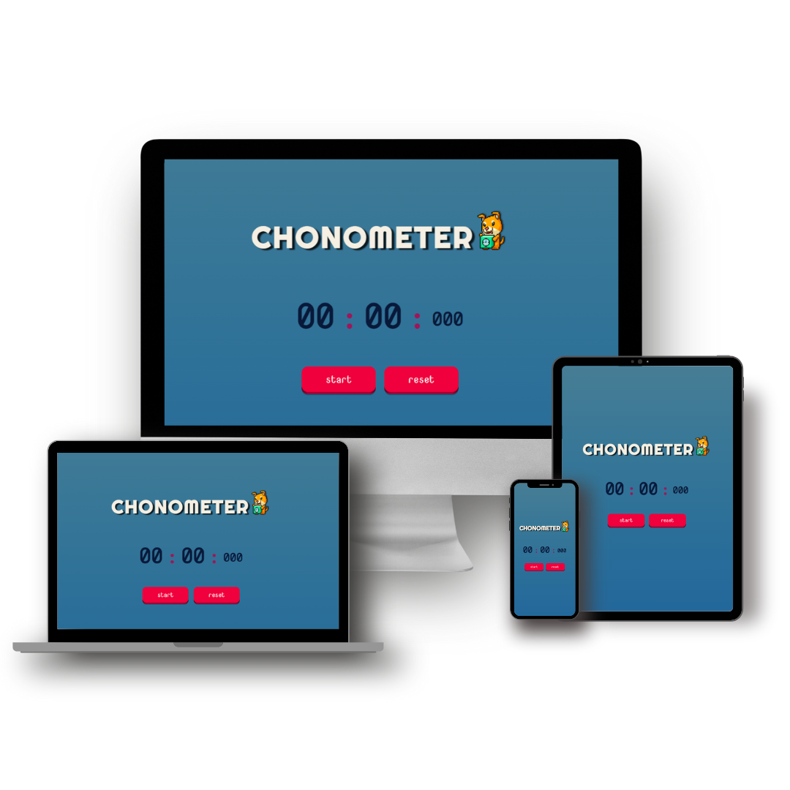

# DevChronometer

## 📄 Descrição

Este projeto é uma página web interativa de um cronômetro simples e funcional. O cronômetro pode ser iniciado, pausado e reiniciado.

 

## 💻 Tecnologias Utilizadas

- HTML5: para a estrutura e marcação da página
- CSS3: para a estilização e layout da página
- JavaScript (JS): para adicionar interatividade e funcionalidades à página

 

## 🗄️Estrutura do Projeto

- 📁 `assets`
  - 📁 `css`
  - 📁 `img`
  - 📁 `js`
- `index.html`

 

## 🎨 Imagens do Projeto

